---
## Front matter
title: "Отчет по по лабораторной работе №2"
subtitle: "По курсу “Архитектура компьютеров и операционные системы”"
author: "Студент первого курса группы НКАбд-02-23 Воловик Алексей Вячеславович"

## Generic otions
lang: ru-RU
toc-title: "Содержание"

## Bibliography
bibliography: bib/cite.bib
csl: pandoc/csl/gost-r-7-0-5-2008-numeric.csl

## Pdf output format
toc: true # Table of contents
toc-depth: 2
lof: true # List of figures
lot: true # List of tables
fontsize: 12pt
linestretch: 1.5
papersize: a4
documentclass: scrreprt
## I18n polyglossia
polyglossia-lang:
  name: russian
  options:
	- spelling=modern
	- babelshorthands=true
polyglossia-otherlangs:
  name: english
## I18n babel
babel-lang: russian
babel-otherlangs: english
## Fonts
mainfont: PT Serif
romanfont: PT Serif
sansfont: PT Sans
monofont: PT Mono
mainfontoptions: Ligatures=TeX
romanfontoptions: Ligatures=TeX
sansfontoptions: Ligatures=TeX,Scale=MatchLowercase
monofontoptions: Scale=MatchLowercase,Scale=0.9
## Biblatex
biblatex: true
biblio-style: "gost-numeric"
biblatexoptions:
  - parentracker=true
  - backend=biber
  - hyperref=auto
  - language=auto
  - autolang=other*
  - citestyle=gost-numeric
## Pandoc-crossref LaTeX customization
figureTitle: "Рис."
tableTitle: "Таблица"
listingTitle: "Листинг"
lofTitle: "Список иллюстраций"
lotTitle: "Список таблиц"
lolTitle: "Листинги"
## Misc options
indent: true
header-includes:
  - \usepackage[T2A]{fontenc}
  - \usepackage[russian]{babel}
  - \usepackage[utf8]{inputenc}
  - \usepackage{indentfirst}
  - \usepackage{float} # keep figures where there are in the text
  - \floatplacement{figure}{H} # keep figures where there are in the text
---

# 1. Цель работы

Изучение идеологии и применение средств контроля версий, а также приобретение практических навыков по работе с системой git.

# 2. Выполнение лабораторной работы

### 2.1 Базовая настройка git

#### Сделаем предварительную конфигурацию git, задав имя пользователя и пароль (рис. 1)
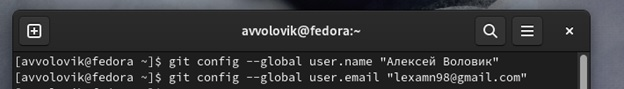
#### Настроим utf-8 в выводе сообщений git, зададим имя начальной ветки, параметр autocrlf и параметр safecrlf (рис. 2)
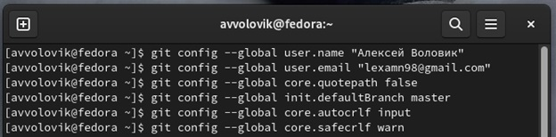

### 2.2 Создание SSH ключа 
#### Создадим SSH ключ (рис. 3)
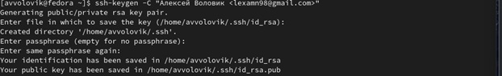
#### С помощью команды cat откроем этот ключ и скопируем его  (рис. 4)
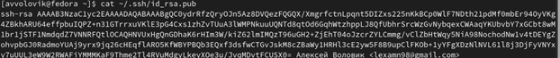
#### Загрузим наш ключ на Github  (рис. 5)
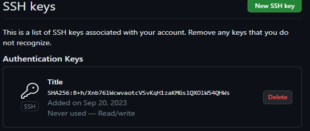

### 2.3 Создание рабочего пространства и репозитория курса на основе шаблона
#### Создадим в терминале каталог для предмета “Архитектура компьютера”  (рис. 6)
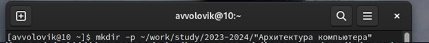

### 2.4 Создание репозитория курса на основе шаблона
#### Переходим на страницу репозитория с шаблоном курса и выбираем “Use this template” (рис. 7)
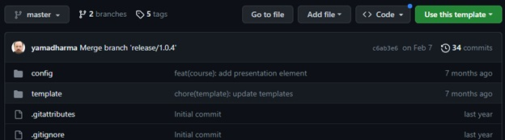
#### В открывшемся окне задаем имя репозитория (Repository name) study_2023–2024_arhpc и нажимаем Create repository (рис.8)
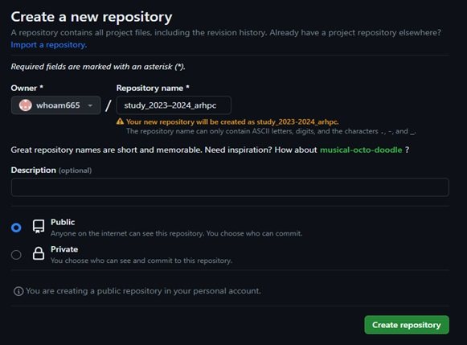
#### Перейдем в каталог курса и клонируем созданный репозиторий (рис.9)
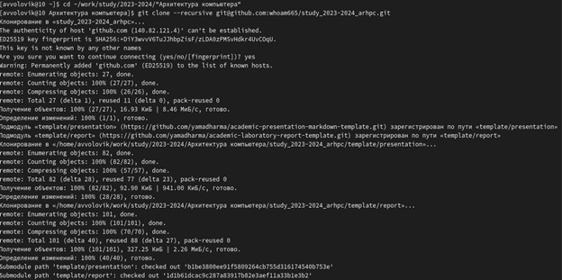

### 2.5	Настройка каталога курса 
#### Перейдем в каталог текущего курса и удалим файл package.json (рис. 10)
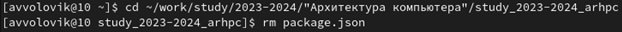
#### Создадим необходимый каталог (рис. 11)
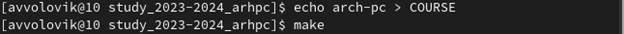
#### Отправим файлы на сервер (в моем случае скриншота первоначального ввода команд нет, подтверждаю корректность их выполнения повторным вводом этих команд)  (рис. 12)
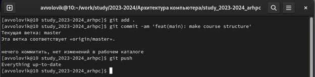
#### Проверим правильность создания иерархии рабочего пространства в локальном репозитории и на странице github  (рис. 13)
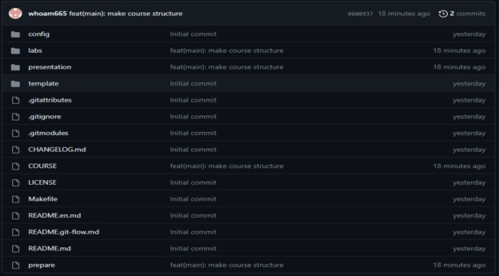

# 3. Выполнение самостоятельной работы

#### 3.1 Загрузим этот и прошлый отчет в соответствующие каталоги рабочего пространства labs>lab02>report и labs>lab01>report соответственно(рис. 14, 15)
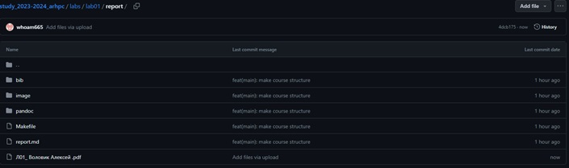
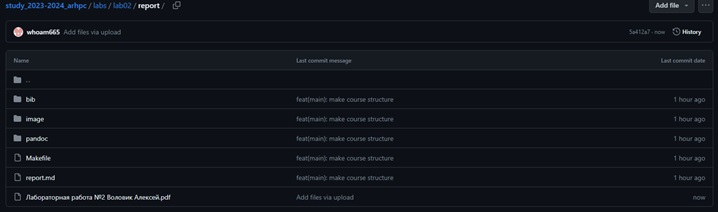

# Вывод
##### Выполняя данную работу, мы ознакомились с применением средства контроля версий, а также приобрели практические навыки по работе с системой git

