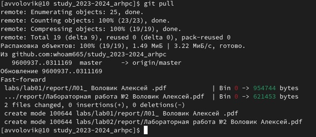
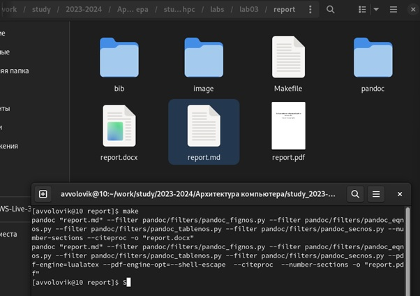
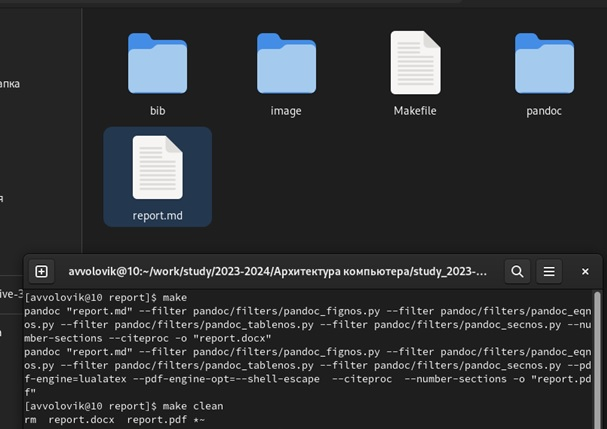
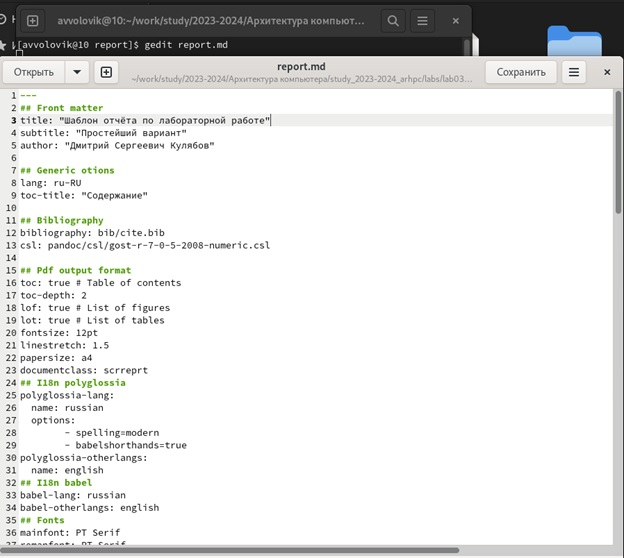

---
## Front matter
title: "Отчет по по лабораторной работе №3"
subtitle: "По курсу “Архитектура компьютеров и операционные системы”"
author: "Студент первого курса группы НКАбд-02-23 Воловик Алексей Вячеславович"

## Generic otions
lang: ru-RU
toc-title: "Содержание"

## Bibliography
bibliography: bib/cite.bib
csl: pandoc/csl/gost-r-7-0-5-2008-numeric.csl

## Pdf output format
toc: true # Table of contents
toc-depth: 2
lof: true # List of figures
lot: true # List of tables
fontsize: 12pt
linestretch: 1.5
papersize: a4
documentclass: scrreprt
## I18n polyglossia
polyglossia-lang:
  name: russian
  options:
	- spelling=modern
	- babelshorthands=true
polyglossia-otherlangs:
  name: english
## I18n babel
babel-lang: russian
babel-otherlangs: english
## Fonts
mainfont: PT Serif
romanfont: PT Serif
sansfont: PT Sans
monofont: PT Mono
mainfontoptions: Ligatures=TeX
romanfontoptions: Ligatures=TeX
sansfontoptions: Ligatures=TeX,Scale=MatchLowercase
monofontoptions: Scale=MatchLowercase,Scale=0.9
## Biblatex
biblatex: true
biblio-style: "gost-numeric"
biblatexoptions:
  - parentracker=true
  - backend=biber
  - hyperref=auto
  - language=auto
  - autolang=other*
  - citestyle=gost-numeric
## Pandoc-crossref LaTeX customization
figureTitle: "Рис."
tableTitle: "Таблица"
listingTitle: "Листинг"
lofTitle: "Список иллюстраций"
lotTitle: "Список таблиц"
lolTitle: "Листинги"
## Misc options
indent: true
header-includes:
  - \usepackage{indentfirst}
  - \usepackage{float} # keep figures where there are in the text
  - \floatplacement{figure}{H} # keep figures where there are in the text
---

# Цель работы

Освоение процедуры оформления отчетов с помощью легковесного языка разметки Markdown.

#  1. Теоретическое введение

#### 1.1 Базовые сведения о Markdown
Чтобы создать заголовок, используйте знак #
Чтобы задать для текста полужирное начертание, заключите его в двойные звездочки
Чтобы задать для текста курсивное начертание, заключите его в одинарные звездочки
Чтобы задать для текста полужирное и курсивное начертание, заключите его в тройные
звездочки
Блоки цитирования создаются с помощью символа >
Упорядоченный список можно отформатировать с помощью соответствующих цифр
Чтобы вложить один список в другой, добавьте отступ для элементов дочернего списка
Неупорядоченный (маркированный) список можно отформатировать с помощью звездочек или тире
Чтобы вложить один список в другой, добавьте отступ для элементов дочернего списка
Синтаксис Markdown для встроенной ссылки состоит из части [link text], представляющей текст гиперссылки, и части – URL-адреса или имени файла, на который дается ссылка
Markdown поддерживает как встраивание фрагментов кода в предложение, так и их размещение между предложениями в виде отдельных огражденных блоков. Огражденные блоки
кода — это простой способ выделить синтаксис для фрагментов кода.

#### 1.2 Оформление формул в Markdown

Внутритекстовые формулы делаются аналогично формулам LaTeX.

#### 1.3 Оформление изображений в Markdown 

В Markdown вставить изображение в документ можно с помощью непосредственного
указания адреса изображения.

Здесь:
* в квадратных скобках указывается подпись к изображению;
* в круглых скобках указывается URL-адрес или относительный путь изображения, а также (необязательно) всплывающую подсказку, заключённую в двойные или одиночные
кавычки.
* в фигурных скобках указывается идентификатор изображения для ссылки
на него по тексту и размер изображения относительно ширины страницы 

#### 1.4 Обработка файлов в формате Markdown 

Преобразовать файл `README.md` можно следующим образом:
`pandoc README.md -o README.pd`f или `pandoc README.md -o README.docx`

# 2. Выполнение лабораторной работы

#### 2.1  	Предварительно произведем установку `TeX Live` и `Pandoc`
=======

#### 2.2  	Перейдем в каталог курса, сформированный при выполнении лабораторной работы №2 и обновим локальный репозиторий, скачав изменения из удаленного репозитория командой `git pull`(рис.1)

#### 2.3   Перейдем в каталог с шаблоном отчета по лабораторной работе № 3 и проведем компиляцию шаблона с использованием `Makefile`. Проверим наличие созданных файлов(рис.2)

#### 2.4 Удалим полученные файлы, используя команду `make clean`, убедимся в корректности выполнения команд (рис.3)

#### 2.5 Откроем файл `report.md`, используя текстовый редактор `gedit` (рис.4)

#### 2.6 Заполним и скомпилируем отчет за данную лабораторную работу, используя команду makefile

#### 2.7 загрузим данные на Github

# 3. Выполнение самостоятельной работы

#### 3.1 Выполним отчет по Лабораторной работе №2 в формате markdown, в качестве овтета предоставив три формата: pdf, docx и md и загрузив файлы на Github

# Вывод
##### Выполнение данный лабораторной и самостоятельной работы помогло освоить и развить навыки в работе с языком разметки markdown
<<<<<<< HEAD

=======
>>>>>>> a4d58cb250925c485ae25a7a9230a327f414afc9
