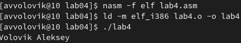

---
## Front matter
title: "Отчет по по лабораторной работе №4"
subtitle: "По курсу “Архитектура компьютеров и операционные системы”"
author: "Автор студент первого курса группы НКАбд-02-23 Воловик Алексей Вячеславович"

## Generic otions
lang: ru-RU
toc-title: "Содержание"

## Bibliography
bibliography: bib/cite.bib
csl: pandoc/csl/gost-r-7-0-5-2008-numeric.csl

## Pdf output format
toc: true # Table of contents
toc-depth: 2
lof: true # List of figures
lot: true # List of tables
fontsize: 12pt
linestretch: 1.5
papersize: a4
documentclass: scrreprt
## I18n polyglossia
polyglossia-lang:
  name: russian
  options:
	- spelling=modern
	- babelshorthands=true
polyglossia-otherlangs:
  name: english
## I18n babel
babel-lang: russian
babel-otherlangs: english
## Fonts
mainfont: PT Serif
romanfont: PT Serif
sansfont: PT Sans
monofont: PT Mono
mainfontoptions: Ligatures=TeX
romanfontoptions: Ligatures=TeX
sansfontoptions: Ligatures=TeX,Scale=MatchLowercase
monofontoptions: Scale=MatchLowercase,Scale=0.9
## Biblatex
biblatex: true
biblio-style: "gost-numeric"
biblatexoptions:
  - parentracker=true
  - backend=biber
  - hyperref=auto
  - language=auto
  - autolang=other*
  - citestyle=gost-numeric
## Pandoc-crossref LaTeX customization
figureTitle: "Рис."
tableTitle: "Таблица"
listingTitle: "Листинг"
lofTitle: "Список иллюстраций"
lotTitle: "Список таблиц"
lolTitle: "Листинги"
## Misc options
indent: true
header-includes:
  - \usepackage[T2A]{fontenc}
  - \usepackage[utf8]{inputenc}
  - \usepackage{indentfirst}
  - \usepackage{float} # keep figures where there are in the text
  - \floatplacement{figure}{H} # keep figures where there are in the text
  - \usepackage{caption}
---

# Цель работы

Освоение процедуры компиляции и сборки программ, написанных на ассемблере NASM

#  1. Теоретическое введение
Основными функциональными элементами любой электронно-вычислительной машины
(ЭВМ) являются центральный процессор, память и периферийные устройства.
Взаимодействие этих устройств осуществляется через общую шину, к которой они подключены. Физически шина представляет собой большое количество проводников, соединяющих
устройства друг с другом. В современных компьютерах проводники выполнены в виде электропроводящих дорожек на материнской (системной) плате.
Основной задачей процессора является обработка информации, а также организация
координации всех узлов компьютера. В состав центрального процессора (ЦП) входят
следующие устройства:
* арифметико-логическое устройство (АЛУ) — выполняет логические и арифметические действия, необходимые для обработки информации, хранящейся в памяти;
* устройство управления (УУ) — обеспечивает управление и контроль всех устройств
компьютера;
* регистры — сверхбыстрая оперативная память небольшого объёма, входящая в состав процессора, для временного хранения промежуточных результатов выполнения
инструкций; регистры процессора делятся на два типа: регистры общего назначения и
специальные регистры.

Для того, чтобы писать программы на ассемблере, необходимо знать, какие регистры
процессора существуют и как их можно использовать. Большинство команд в программах
написанных на ассемблере используют регистры в качестве операндов. Практически все
команды представляют собой преобразование данных хранящихся в регистрах процессора,
это например пересылка данных между регистрами или между регистрами и памятью, преобразование (арифметические или логические операции) данных хранящихся в регистрах.

# 2. Выполнение лабораторной работы

#### 2.1   Установим ассемблер `NASM` (рис.1)

#### 2.2  Создадим текстовый файл с именем `hello.asm` (рис.2), отредактируем его, добавив необходимый текст из лабораторной работы и скомпилировав (рис.3) (рис.4)

#### 2.3   Скомпилируем файл `hello.asm` в `obj.o`, создавая файл листинга (рис.5)

#### 2.4 Передадим объектный файл на обработку компановщику (рис.6)

#### 2.5 Выполним команду `ld -m elf_i386 obj.o -o main`, имя исполняемого файла будет `main`(рис.7)

#### 2.6 Запустим исполняемый файл `hello` (рис.8)

# 3. Выполнение самостоятельной работы

#### 1) Создадим копию файла `hello.asm` с новым именем `lab4.asm`, отредактируем новый файл так, чтобы выводилась мои фамилия и имя (рис.9)

#### 2) Оттранслируем текст в объектный файл, проведем его компановку и запустим (рис.10)

#### 3) Скопируем исходный файл ассемблера, и отредактированный в локальный репозиторий курса (рис.11)

#### 4) Загрузим файлы на github

# Вывод
* Выполнение лаборатной работы позволило понять основы работы с ассемблером NASM, а именно процедуры компиляции и сборки программ 

* Выполнение самостоятельной работы позволило закрепить понятие процесса компиляции и сборки программ в ассемблере NASM 

